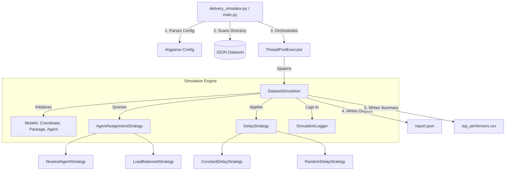

# 📦 FastBox Delivery Simulator

[](https://www.python.org/)
[]()
[](https://docs.pytest.org/)

An enterprise-grade, high-performance logistics simulation engine designed for **FastBox**, a fictional delivery network. The system simulates daily parcel dispatching, coordinates dynamic warehouse pickups and final-destination drop-offs, routes vehicles using advanced heuristics, and exports structured analytical reports.

---

## 🏗️ System Architecture

The simulation engine is designed using **Object-Oriented Programming (OOP)** principles and the **Strategy Pattern** to ensure high decoupling, testability, and extensibility.



---

## 📈 Key Architecture Patterns

1. **Strategy Pattern (Decoupled Deciders):** 
   Both agent selection algorithms and delay multipliers are modeled as polymorphic interfaces (`AgentAssignmentStrategy` and `DelayStrategy`). This allows developers to introduce new logistics logic without altering the simulation loop.
2. **Concurrency (High-Performance Parallelism):** 
   Utilizes a Python `ThreadPoolExecutor` to handle multi-dataset processing concurrently.
3. **Thread-Safe Logging Buffer:** 
   To prevent garbled logs during parallel executions, console outputs are collected in a thread-safe memory buffer and flushed atomically when a simulation finishes.
4. **Data Normalization:** 
   Translates raw JSON input into typed structures (`Coordinate`, `Package`, `Agent`) ensuring early validation.

---

## 🧮 Mathematical Formulations

### 1. Distance Calculation (Euclidean Metric)
For any two coordinates $P_1(x_1, y_1)$ and $P_2(x_2, y_2)$, the straight-line distance is computed as:
$$d = \sqrt{(x_2 - x_1)^2 + (y_2 - y_1)^2}$$

### 2. Delivery Path Cost
The total distance covered by an agent for a package delivery is:
$$\text{Total Distance} = \text{Distance}(\text{Agent} \to \text{Warehouse}) + \left(\text{Distance}(\text{Warehouse} \to \text{Destination}) \times \text{Delay Factor}\right)$$

### 3. Agent Efficiency Rating
$$\text{Efficiency} = \frac{\text{Total Distance Traveled}}{\text{Total Packages Delivered}}$$
*Note: A lower efficiency value indicates a higher performance rating.*

---

## 🌟 Bonus Features Implemented

*   **Random Delivery Delays:** Simulates variable real-world factors (traffic, weather) by applying a random delay coefficient between $1.0$ and $1.2$ to destination routes.
*   **ASCII Route Visualization Grid:** Draws a real-time, scaled 2D spatial grid representation of the coordinate plane for each delivery showing the path taken.
*   **Dynamic Mid-Day Agent Sign-ups:** Parses dynamic agent arrivals mid-simulation, making them immediately available for assignment in subsequent orders.
*   **Analytical Exports (CSV + JSON):** Summarizes logs into a detailed JSON breakdown (`report.json`) and registers top performers in a clean tabular CSV (`top_performers.csv`).

---

## 📂 Project Tree

```
Fastbox-Delivery/
├── data/                       # Dataset directories
│   ├── base_case.json          # Primary verification dataset
│   ├── test_case_1.json        # Dynamic agent joining case
│   └── ...                     
├── fastbox_delivery/           # Core Source Package
│   ├── __init__.py             
│   ├── main.py                 # CLI parsing & execution coordinator
│   ├── models.py               # Geometric data structures & models
│   ├── simulator.py            # Simulation engine & ASCII map renderer
│   └── strategies.py           # Allocation & Delay strategies
├── tests/                      # Automated test suite
│   └── test_simulator.py       # Pytest cases
├── delivery_simulator.py       # Root script execution wrapper
├── report.json                 # Generated detailed JSON report
└── top_performers.csv          # Generated CSV summary of best agents
```

---

## ⚙️ Configuration & Execution Guide

### Prerequisites
* Python 3.8 or higher.
* `pytest` (only required for running unit tests).

```bash
# Install testing framework
pip install pytest
```

### Basic Run
Run the simulation across all datasets using default parameters (deterministic, no delays, nearest-neighbor):
```bash
python delivery_simulator.py
```

### Enabling ASCII Map Visualization
To display 2D path visualizations on the console during execution:
```bash
python delivery_simulator.py --visualize
```

### Advanced Usage Examples
```bash
# Enable parallel processing & random delays with a reproducible seed
python delivery_simulator.py --parallel --random-delay --seed 42

# Configure custom CSV file output
python delivery_simulator.py --csv-output custom_report.csv

# Use Workload-Balanced strategy to distribute assignments evenly
python delivery_simulator.py --strategy load_balanced --alpha 12.5
```

---

## 🗺️ ASCII Map Guide

When running with `--visualize`, each delivery prints a grid showing:

```
ASCII Route Map:
+--------------------------------------------------------------+
|  .  .  .  .  .  .  .  .  .  .  .  .  .  .  .  .  . A1  .  .  |
|  .  .  .  .  .  .  .  .  .  .  .  .  .  .  . W3  .  .  .  .  |
|  .  .  .  .  .  .  .  .  .  .  .  .  .  .  .  .  .  .  .  .  |
|  .  .  .  .  .  .  .  .  .  .  .  .  .  .  .  .  .  .  .  .  |
|  .  # W2 A2* .  .  .  .  .  .  .  .  .  .  .  .  .  .  .  .  |
| DST .  .  .  .  .  .  .  .  .  .  .  .  .  .  . A3  .  .  .  |
|  .  .  .  .  .  .  .  .  .  .  .  .  .  .  .  .  .  .  . W1  |
+--------------------------------------------------------------+
Legend: A2*=Agent Start, W2=Warehouse, DST=Destination, *=To WH, #=To DST
```

*   `A2*` : The starting position of the active agent.
*   `W2` : The warehouse where the package is picked up.
*   `DST` : The package destination.
*   `*` : The path coordinates traversed from the agent to the warehouse.
*   `#` : The path coordinates traversed from the warehouse to the destination.
*   `A1`, `A3`, `W1` : Inactive agents and warehouses showing spatial context.

---

## 🧪 Testing
Run the automated test suite to ensure mathematical and logical accuracy:
```bash
python -m pytest
```
